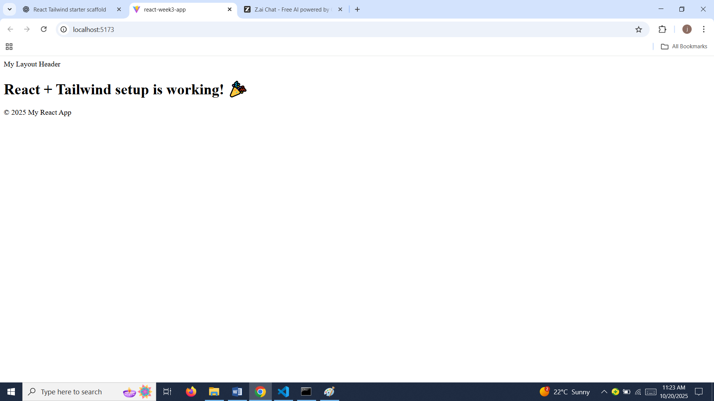
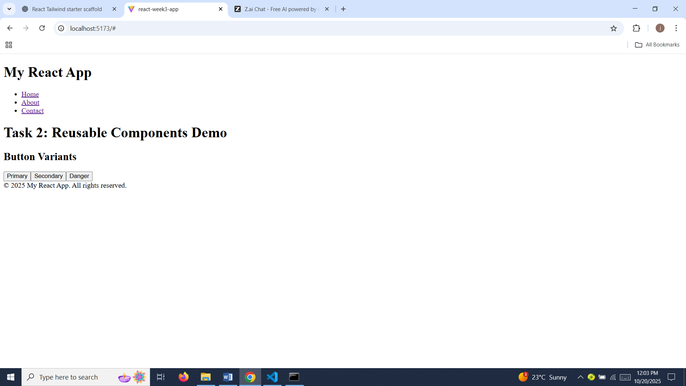
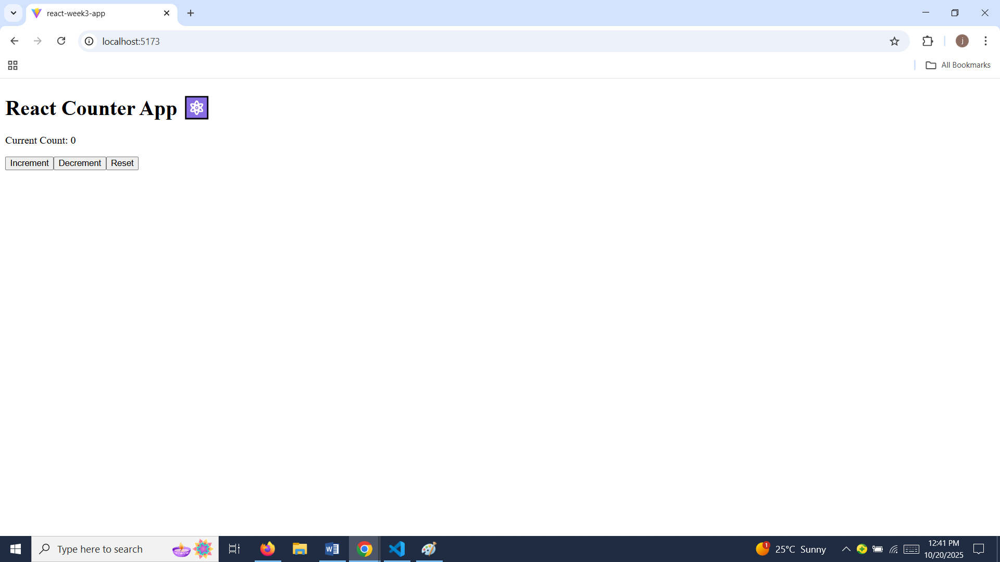
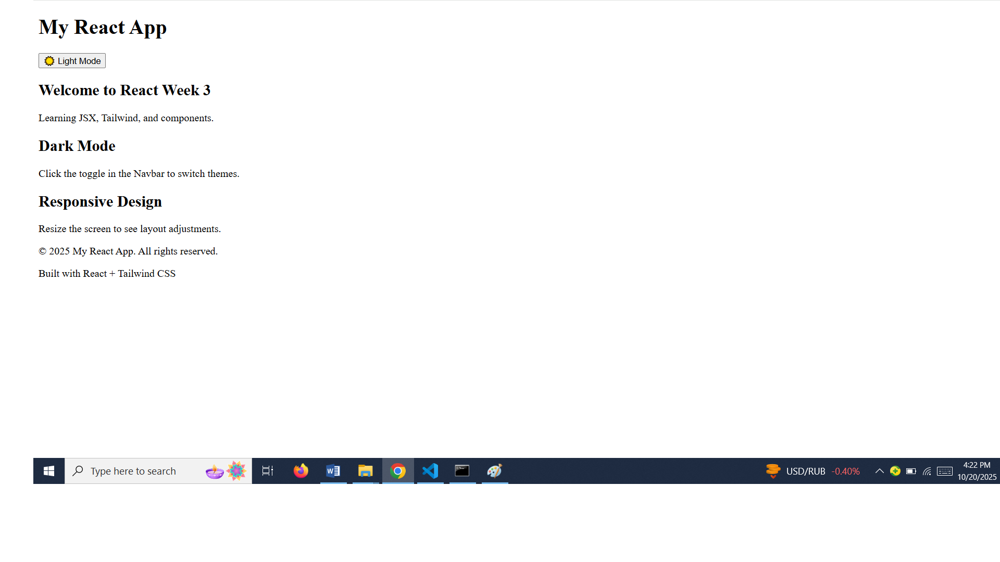

# Week 3: React.js, JSX, and Tailwind CSS – Mastering Front-End Development

## 🚀 Objective
Build a responsive React application using JSX and Tailwind CSS that demonstrates component architecture, state management, hooks usage, and API integration.

---
## ⚙️ Task 1: Project Setup (React + Tailwind)
- Created a new React project using **Vite**
- Installed and configured **Tailwind CSS**
- Verified that Tailwind styles load correctly in the app

### 🖼️ Screenshot:



---

## 🧱 Task 2: Component Architecture
- Built reusable components: `Button`, `Card`, `Navbar`, and `Footer`
- Implemented a shared `Layout` with `Navbar` and `Footer`
- Used props for customization

**Screenshot:**



---

## 🧠 Task 3: State Management and Hooks

- Implemented a `Counter` component that uses:
  - **useState** for managing state (count value)
  - **useEffect** for handling side effects (saving to localStorage)
  - **Custom Hook (`useLocalStorage`)** for persistent data
- The counter allows users to:
  - Increment, Decrement, and Reset values
  - Retain the count even after refreshing the page
- Styled the component using Tailwind CSS

### 🖼️ Screenshot:



---

## 🌐 Task 4: API Integration
- Fetched data from a public API (e.g., JSONPlaceholder)
- Displayed data in grid view with loading and error states
- Added search and pagination

**Screenshot:**


---

## 🎨 Task 5: Styling with Tailwind CSS
- Created a responsive design for all devices
- Added Tailwind dark mode and animations

**Screenshot:**


---

## 🧪 Final Outcome
- Fully functional React app with component-based architecture  
- State management and API integration working  
- Responsive and visually appealing with Tailwind CSS  

**Deployed Link:**  
👉 [https://vercel.com/jaqueline-ngwavas-projects/react-js-jsx-and-css-mastering-front-end-development-20231990]  

---

## ⚙️ Setup Instructions
To run locally:

```bash
npm install
npm run dev


